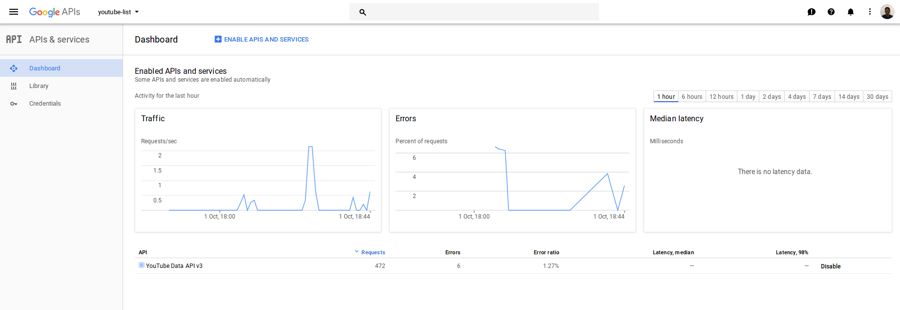
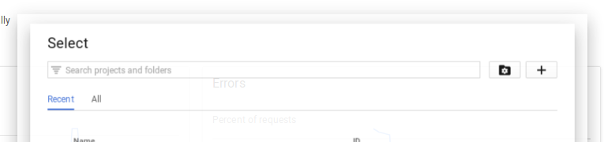
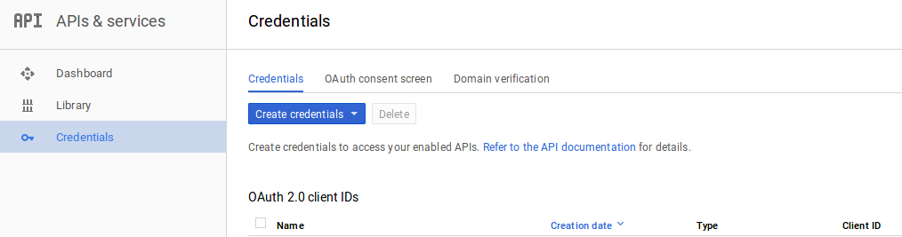

# Chronological Playlists for Channels

> Create a playlist of the videos uploaded by a channel in chronological order


## How?

_Warning:_ Using this script is not easy or intuitive. I apologise for that. I planned
to put this up as a Web application, but building that was cumbersome so I
didn't do it. If you want to take it up, please feel free to submit a patch!

Clone this repository and create a `.env` file.

`$ touch .env`

`.env` template:

```sh
OAUTH2_CLIENT_ID=
OAUTH2_SECRET=
CHANNELS=
CHANNEL_IDS=
YOUTUBE_OAUTH2_TOKEN=
UPDATE_PLAYLIST=false
```

1. Visit the [Google API Console](https://console.developers.google.com/apis/)

    

2. Create a new project: Click on the dropdown in the top left next to the
Google APIs logo, then press on the PLUS icon and create a new project.

    

3. Enable the Youtube Data API for your project
4. Create OAuth2 Credentials for your project

    

5. Copy the CLIENT_ID and CLIENT_SECRET to your `.env` file template
6. After copying, run the `oauth2.js` script using:

    ```sh
    $ node oauth2.js
    ```

    This will give you a URL. Open it in your browser and grant access so that the
    app can add videos to the playlist.

7. Copy the token displayed in your browser and paste it back into the terminal
window

8. You will see an output like this:

    ```sh
    COMPLETED!


    Access token:

    ya29.GlvXBGOsnx0eRrkPKtRfUKRtE_CmW47r6cMmOrzZF-8yu8jx0ZVANfPqW-NTA3qW7v8-HRbMbdH0U-xooYxRNZnEO9i5pjJT45tr7e4d1B1hLqiHadtysh8MK4Gm4
    ```

    In this, copy the access token and paste it as the value for the
    `YOUTUBE_OAUTH2_TOKEN` key in the `.env` template.

9. Put the name of the channel that you want to create the playlist for in the
    `.env` file.

    Note that you _have_ to put the usernames of the channels. i.e if the
    channel is available at

    ```
    https://www.youtube.com/user/h2h2productions
    ```

    then the username is `h2h2productions`.

    If you have the channel ID for the channel, then you have to put that as a
    comma separated string as the value of the variable `CHANNEL_IDS`

10. Change the line `UPDATE_PLAYLIST=false` to `UPDATE_PLAYLIST=true` in the
    .env file. This is a safety flag that exists in case you just want to check
    if the script runs without making any changes to the playlist.

11. Now, RUN the script!

    ```sh
    $ node index.js
    ```

    The script will create a playlist with name "_Channel Names_ Chronological _Date_",
    then add the channels' videos in chronological order to the playlist

_Note:_ These are for a future-me as much as for anyone else out there, so if
you don't understand a sentence, please open an issue! we can figure it out
together.

## Why?

In the YouTube universe, search is great, CDNs are everywhere and DevOps is
amazing. But binging on all the videos a channel has uploaded is not great. In
fact, it's one of the most irritating things to do. I have searched for online
websites that do it, browser plugins that will autoplay videos. No luck
anywhere.

Considering that the Youtube Data API is well documented, I decided to write
this script.
